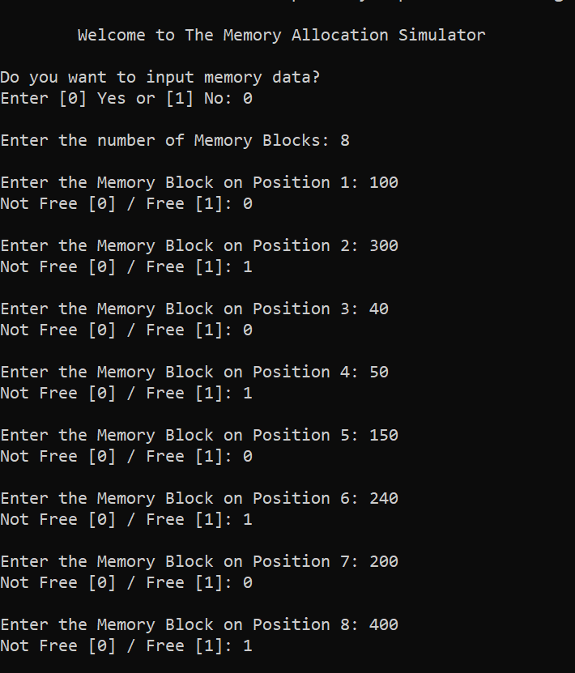
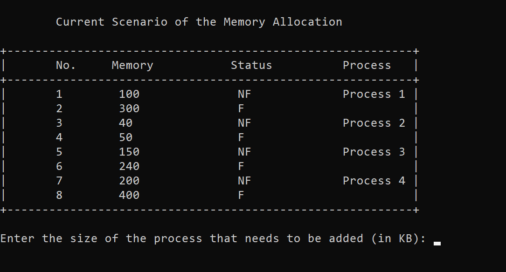
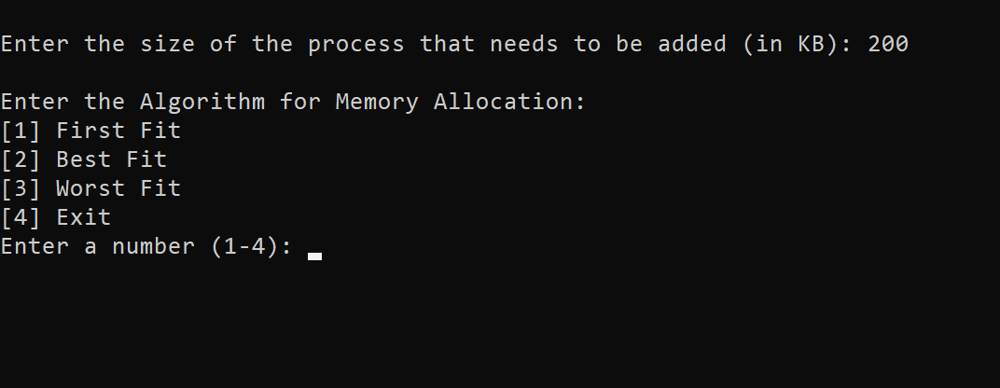
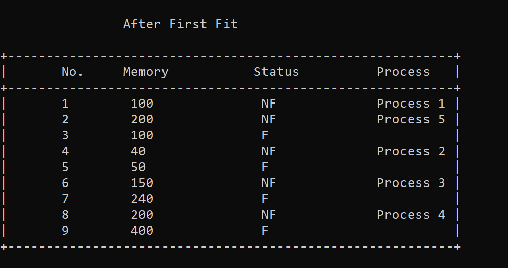
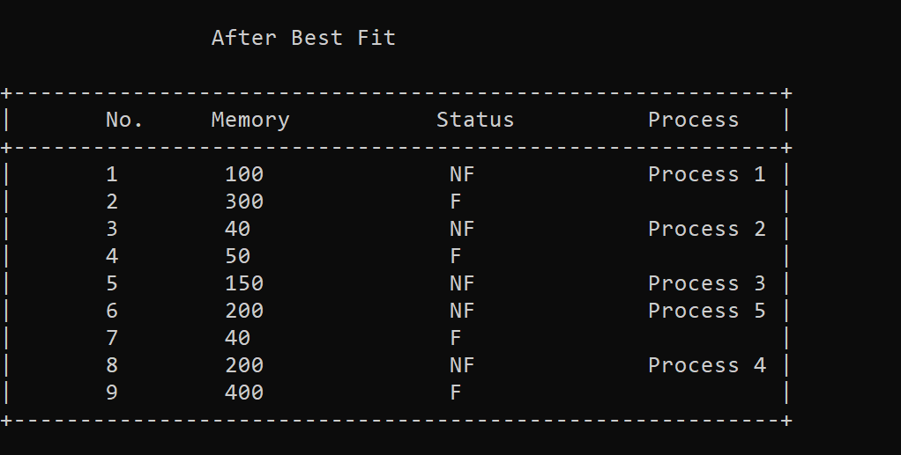
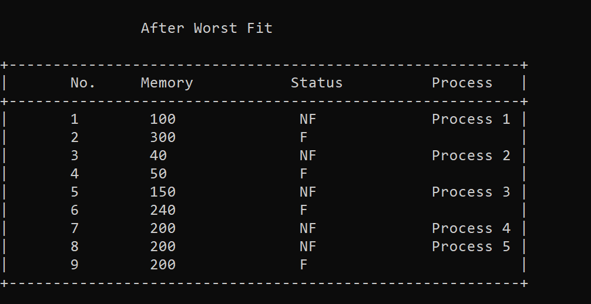
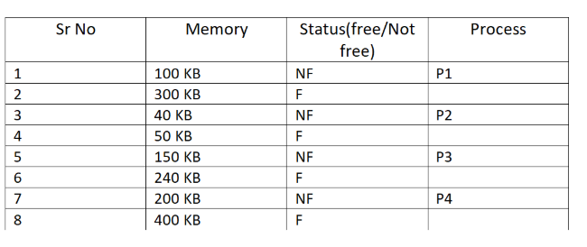
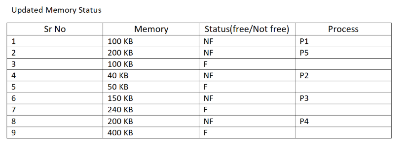
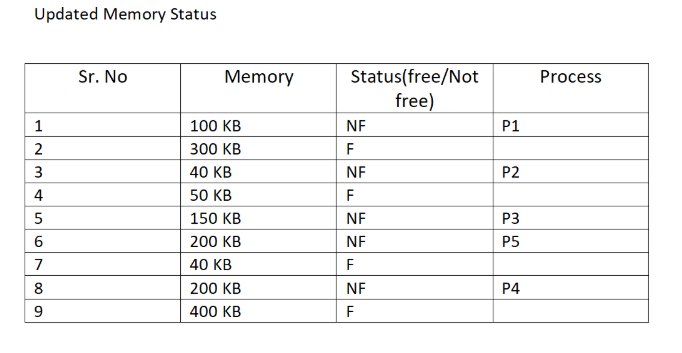
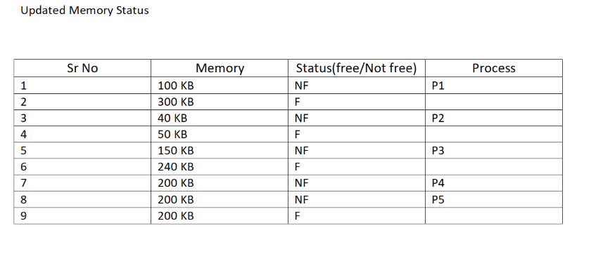

# Memory Allocation Simulator

### Table of contents

- [Introduction](#introduction)
- [Demonstration](#demonstration)
- [Algorithms](#algorithms)
- [Local Setup](#local-setup)
- [Author](#author)
- [License](#license-)

## *Introduction*

A simple Memory Allocation Simulatory built with JAVA, for a better understanding of how memory allocation works in an **Operating System**. It simulates common **memory allocation strategies**:

- **First-Fit**
- **Best-Fit**
- **Worst-Fit**

## Demonstration

- Welcome to the Memory Allocation Simulator.
- First, we ask whether the user wants to enter a values or not, if not, then a few values are already hardcoded.
- The hardcoded values are important for understanding, debugging and saving time.

- After taking the input value of the Memory Divisions, their current status (Free/Not Free) and the process numbers, we print the current table of the Memory Allocation.

- So now, we take the size of the input process, and a menu comes up.

- Output for the First Fit

- Output for the Best Fit

- Output for the Worst Fit

## Algorithms

A simple Memory Allocation Simulatory built with JAVA, for a better understanding of how memory allocation works in an **Operating System**. It simulates common **memory allocation strategies**:

- **First-Fit**
  - In the first fit approach is to allocate the first free partition or hole large enough which can accommodate the process.
  - *Advantage*: It finishes after finding the first suitable free partition. **Fastest algorithm because it searches as little as possible.**
  - *Disadvantage*: **Internal Fragmentation** - The remaining unused memory areas left after allocation become waste if it is too smaller. Thus, request for larger memory requirement cannot be accomplished.
- **Best-Fit**
  - The best fit deals with allocating the smallest free partition which meets the requirement of the requesting process. This algorithm first searches the entire list of free partitions and considers the smallest hole that is adequate.
  - *Advantage*: It then tries to find a hole which is close to actual process size needed. Memory utilization is much better than first fit as it searches the smallest free partition first available.
  - *Disadvantage*: It is slower and may even tend to fill up memory with tiny useless holes.
- **Worst-Fit**
  - In worst fit approach is to locate largest available free portion so that the portion left will be big enough to be useful. It is the reverse of best fit.
  - *Advantage*: Reduces the rate of production of small gaps.
  - *Disadvantage*: If a process requiring larger memory arrives at a later stage then it cannot be accommodated as the largest hole is already split and occupied.

---

Before processing every simulation, the user has to input the **Current Memory Division/Allocation**, i.e. Memory Division, Status, Process Name.

Currently, the memory allocation is **hardcoded** for saving time and easy debugging of this example.

### Current Memory Allocation

If input process is of size 200 KB, then:

#### Memory Allocation - First Fit

#### Memory Allocation - Best Fit

#### Memory Allocation - First Fit

## *Local Setup*

* Download the latest version of Java - [Java SE - Downloads | Oracle](https://www.oracle.com/java/technologies/javase-downloads.html).
* Clone the repository: `git clone https://github.com/tusharnankani/MemoryAllocationSimulator.git`
* Open this directory in Command Promt or Shell.
* Compile the file using the command: `javac MemoryAllocation.java`
* Run the file using the command: `java MemoryAllocation`

## Author

Tushar Nankani

[LinkedIn](https://www.linkedin.com/in/tusharnankani/) | [Twitter](https://twitter.com/tusharnankanii)

## License 📜

[GPU License](https://github.com/tusharnankani/MemoryAllocationSimulator/blob/master/LICENSE)
